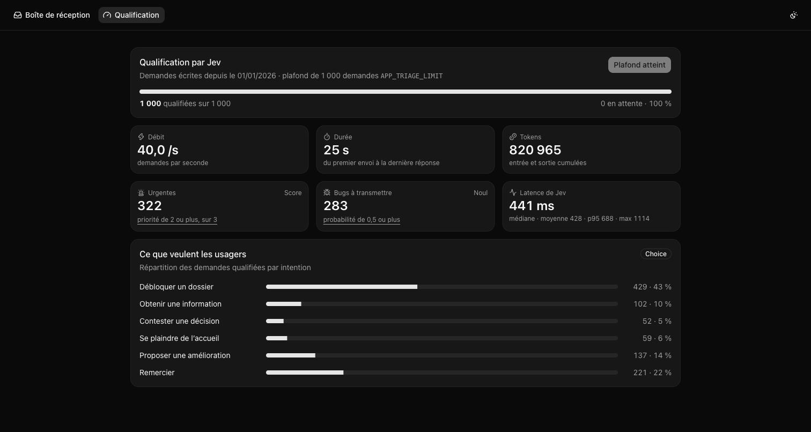
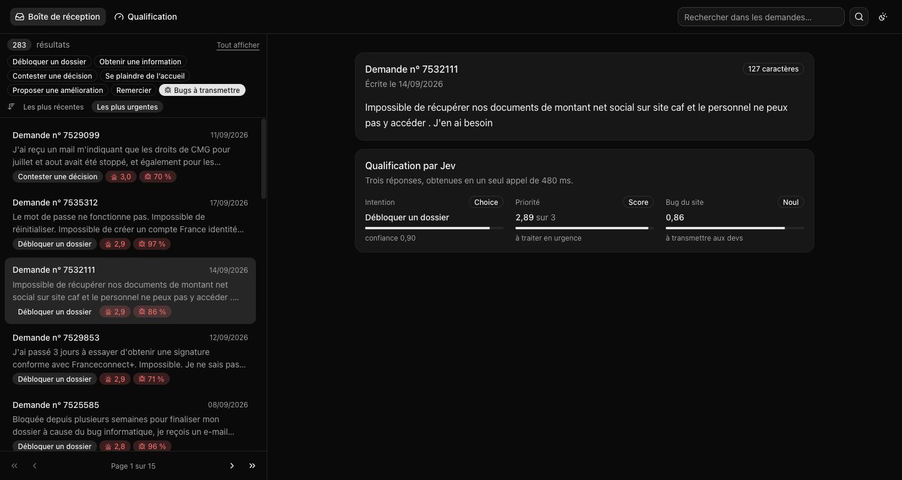
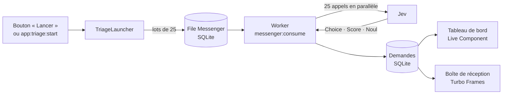

# Trier des demandes de support avec Jev et Symfony AI

Une application Symfony qui lit de vraies demandes adressées aux services publics français et
laisse **Jev**, le modèle « System One » de [TypeSafe](https://docs.typesafe.ai/concepts/system-one),
les qualifier : ce que veut la personne, à quel point c'est urgent, et s'il s'agit d'un bug à
transmettre aux développeurs.

> Ce dépôt accompagne un article de blog et une vidéo YouTube. Il est fait pour être cloné,
> lancé et bidouillé pendant que vous les suivez.



## Jev en deux mots

Jev ne génère pas de texte. On lui donne un contenu et des questions typées, il répond par des
probabilités, en quelques centaines de millisecondes. La démo utilise ses trois types de questions,
posées **ensemble, en un seul appel** par demande :

| Type | La question posée ici | Ce que Jev renvoie |
|---|---|---|
| **Choice** | Qu'attend la personne ? | Une intention parmi six, la probabilité de chacune, une confiance |
| **Score** | À quel point est-ce urgent ? | Une priorité de 0 à 3, sur des niveaux décrits en clair |
| **Noul** | Est-ce un bug du site à transmettre aux devs ? | Une probabilité entre 0 et 1 |



## Ce que fait l'application

- **Importe** le jeu de données ouvert des témoignages d'usagers (environ 260 Mo), en flux, dans
  une base SQLite. Seul le texte des demandes est conservé.
- **Affiche** les demandes dans une boîte de réception : liste paginée, recherche, lecture sans
  rechargement de page.
- **Qualifie** les demandes avec Jev, en arrière-plan : les demandes partent dans une file
  Messenger par lots de 25, un worker interroge Jev en parallèle et enregistre les réponses.
- **Suit** la qualification en direct : avancement, débit, latence de Jev, tokens consommés,
  répartition par intention.
- **Exploite** les réponses : filtres par intention, par « bugs à transmettre », tri par urgence.

À titre indicatif, mesuré en septembre 2026 sur un ordinateur portable : **1 000 demandes
qualifiées en 25 secondes**, 428 ms de latence moyenne par appel, environ 820 000 tokens, soit
quelques centimes au tarif constaté alors.

## Prérequis

- PHP 8.4 ou plus récent, avec les extensions `pdo_sqlite`, `ctype` et `iconv`
- [Composer](https://getcomposer.org/)
- Le [Symfony CLI](https://symfony.com/download), recommandé : il lance le serveur, le worker et la compilation du CSS d'un seul geste
- Une clé d'API [TypeSafe](https://docs.typesafe.ai/)

Ni Docker, ni Node.js, ni serveur de base de données.

## Démarrage

```bash
git clone https://github.com/yoanbernabeu/demo-symfony-typesafe.git
cd demo-symfony-typesafe
composer install
```

Créez un fichier `.env.local` avec votre clé. Il est ignoré par git : la clé ne quitte pas votre machine.

```dotenv
TYPESAFE_API_KEY=votre-cle
```

Vérifiez que Jev répond :

```bash
bin/console app:jev:test
```

Préparez ensuite les données et l'interface :

```bash
bin/console doctrine:migrations:migrate --no-interaction   # crée la base SQLite dans var/
bin/console app:dataset:download                           # télécharge le jeu de données (environ 260 Mo)
bin/console app:dataset:import                             # importe les demandes écrites depuis 2025
bin/console tailwind:build                                 # compile le CSS
symfony serve
```

Ouvrez http://127.0.0.1:8000, puis la page **Qualification**, et cliquez sur « Lancer la qualification ».

<details>
<summary>Sans le Symfony CLI</summary>

Lancez le serveur web de PHP et, dans un second terminal, le worker qui traite la file :

```bash
php -S 127.0.0.1:8000 -t public
bin/console messenger:consume async --no-debug
```

`--no-debug` compte : en mode debug, un worker qui attend sans rien faire grossit de plus d'un mégaoctet
par minute, jusqu'à ce que PHP l'arrête. Après un changement de configuration, lancez
`bin/console cache:clear` avant de le redémarrer.

</details>

## Régler la qualification

Quatre variables, à surcharger dans `.env.local` :

| Variable | Défaut | Rôle |
|---|---|---|
| `APP_TRIAGE_SINCE` | `2026-01-01` | Seules les demandes écrites depuis ce jour sont envoyées à Jev |
| `APP_TRIAGE_LIMIT` | `1000` | Plafond du nombre total de demandes envoyées à Jev, pour maîtriser la facture. `0` retire le plafond |
| `APP_TRIAGE_BATCH_SIZE` | `25` | Nombre de demandes par message, envoyées à Jev en même temps |
| `APP_TRIAGE_REQUESTS_PER_MINUTE` | `1100` | Débit maximal vers Jev. TypeSafe refuse au-delà de 1 200 requêtes par minute |

Un run de 1 000 demandes tient dans la minute et va à pleine vitesse. Au-delà, le worker se met en
pause jusqu'à la minute suivante et le tableau de bord l'indique : comptez environ une minute par
tranche de 1 100 demandes.

## Les commandes

| Commande | Rôle |
|---|---|
| `app:jev:test` | Envoie un ticket d'exemple à Jev et affiche les réponses typées, les tokens et la réponse brute |
| `app:dataset:download` | Télécharge le jeu de données depuis data.gouv.fr. `--force` pour le retélécharger |
| `app:dataset:import` | Importe les demandes en base. `--since=2026-01-01` et `--limit=500` pour n'en charger qu'une partie. Sans risque à relancer |
| `app:triage:start` | Met les demandes en file, comme le bouton de la page Qualification |
| `app:triage:reset` | Oublie les réponses de Jev, pour rejouer la qualification |

## Comment ça marche



- Le parallélisme se fait **dans** chaque lot : un seul worker suffit, et SQLite n'a qu'un écrivain à la fois.
- Si Jev échoue sur une partie d'un lot, ce qui a réussi est enregistré et Messenger rejoue le
  message : seules les demandes manquantes sont redemandées.
- Un limiteur de débit (RateLimiter, fenêtre fixe) compte un jeton par requête : le worker attend
  quand la minute est consommée, plutôt que de se faire refuser par l'API.
- Le tableau de bord ne reçoit rien du worker. C'est un Live Component qui se relit chaque seconde
  tant que des demandes sont en attente : le worker et le site partagent la base, il n'y a donc
  aucun service de temps réel à installer.

## Sous le capot

| Besoin | Réponse Symfony |
|---|---|
| Parler à Jev | [Symfony AI](https://symfony.com/doc/current/ai/index.html) et son bridge TypeSafe |
| Traitement en arrière-plan | Messenger, transport Doctrine, message routé par `#[AsMessage]` |
| Respecter le débit de l'API | RateLimiter, avec Lock |
| Persistance | Doctrine ORM sur SQLite, migrations |
| Lire la query string | `#[MapQueryString]` vers un objet validé |
| Navigation sans rechargement | [Turbo Frames](https://ux.symfony.com/turbo) |
| Suivi en direct | [Live Components](https://ux.symfony.com/live-component), par polling |
| Comportements navigateur | [Stimulus](https://ux.symfony.com/stimulus) : deux petits contrôleurs |
| Composants d'interface | [Twig Components](https://ux.symfony.com/twig-component) et le [kit shadcn de UX Toolkit](https://ux.symfony.com/toolkit/kits/shadcn) |
| Style et icônes | Tailwind CSS via TailwindBundle, [UX Icons](https://ux.symfony.com/icons), AssetMapper |

Les composants du kit sont copiés dans `templates/components/` : ils font partie du projet et se
modifient librement. Pour en ajouter un :

```bash
bin/console ux:install dialog --kit shadcn
```

## Où regarder dans le code

| Chemin | Ce qu'on y trouve |
|---|---|
| `src/Command/JevTestCommand.php` | Un appel complet à Jev, des questions aux réponses typées |
| `src/Triage/ExperienceTriage.php` | Les trois questions de la démo, posées en un seul appel |
| `src/Triage/Intention.php` | L'enum des intentions : options pour Jev et type de colonne en base |
| `src/Triage/TriageLauncher.php` | La mise en file, dans la limite du plafond |
| `src/Message/` et `src/MessageHandler/` | Le traitement asynchrone d'un lot |
| `src/Twig/Components/TriageDashboard.php` | Le tableau de bord qui s'actualise seul |
| `src/Controller/InboxController.php` et `templates/inbox/` | La boîte de réception et ses Turbo Frames |
| `src/Dataset/` | Le téléchargement, la lecture en flux et l'import du jeu de données |
| `packages/ai-type-safe-platform/` | Le bridge TypeSafe pour Symfony AI |
| `config/services.yaml` | La déclaration de la plateforme TypeSafe |

### Le bridge TypeSafe

Le bridge est embarqué dans `packages/ai-type-safe-platform/` et chargé par Composer comme un
paquet local : il n'y a rien d'autre à installer. Il apporte les trois types de questions
(`ChoiceQuestion`, `ScoreQuestion`, `NoulQuestion`), l'objet `Evaluation` qui les regroupe et
les réponses typées (`Answers`). La plateforme est déclarée dans `config/services.yaml` ; le tag
`ai.platform` la branche sur le profiler de l'AI Bundle, où chaque appel à Jev est visible.

## Les tests

```bash
bin/console tailwind:build   # une fois, les pages testées chargent le CSS compilé
php bin/phpunit
```

Les tests n'appellent jamais Jev : ses réponses sont simulées par un faux client HTTP. Aucune clé
n'est nécessaire, aucun crédit n'est consommé.

## Les données

Les demandes viennent du jeu
[« Liste des expériences partagées par les usagers »](https://www.data.gouv.fr/datasets/liste-des-experiences-partagees-par-les-usagers),
publié par la Direction interministérielle de la transformation publique (DITP) sur data.gouv.fr,
sous [Licence Ouverte 2.0](https://www.etalab.gouv.fr/licence-ouverte-open-licence/). Le jeu de
données n'est pas inclus dans ce dépôt : la commande `app:dataset:download` le récupère à la source.

Ce sont de vrais témoignages, parfois de vraies détresses. L'application n'en garde que
l'identifiant, la date et le texte.

## Licence

Le code de ce dépôt est sous [licence MIT](LICENSE). Le bridge embarqué dans
`packages/ai-type-safe-platform/` porte sa propre licence MIT.
